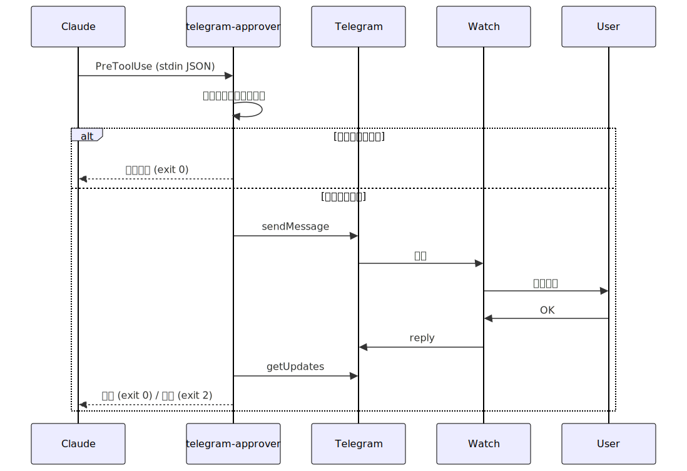

# スマートウォッチで Claude Code を承認する
### ～ telegram-approver の紹介 ～


---

## 自己紹介
<style>
.self-intro {
  display: flex;
  align-items: center;
  gap: 20px;
}

.self-intro img {
  width: 250px;
  border-radius: 50%;
}
</style>

<div class="self-intro">
  
  <div>
    <ul>
      <li><strong>名前:</strong> sasamoto takumi</li>
      <li><strong>会社:</strong> and roots株式会社</li>
      <li><strong>所属:</strong> グロースハック</li>
      <li><strong>職業:</strong> Webエンジニア</li>
      <li><strong>得意分野:</strong> バックエンド開発, インフラ構築</li>
      <li><strong>趣味:</strong> ゲーム, 個人開発, 筋トレ, ギター</li>
      <li><strong>GitHub:</strong> <a href="https://github.com/motty93">motty93</a></li>
    </ul>
  </div>
</div>


---

## 今日の内容

1. Claude Code の課題
2. telegram-approver とは
3. システム構成
4. hook モードの仕組み
5. デモ
6. まとめ

---

## Claude Code の課題

- Claude Code はファイル編集やコマンド実行の前に **承認** を求める
- PC の前にいないと承認できない
- 長時間タスクを投げて離席すると **止まったまま** になる

**「スマートウォッチから承認できたら便利では？」**

---

## telegram-approver とは

- **Telegram Bot API** を使った承認フロー CLI ツール
- Claude Code の **PreToolUse hook** として動作
- Go 製、`go install` で導入可能

```bash
go install github.com/motty93/telegram-approver@latest
```

- `$GOPATH/bin` に PATH が通っていればそのまま使える
- ツール種別に応じて **自動判定** → 危険な操作のみ承認要求
- タイムアウト 10 分、リトライ機構付き
- 事前に Telegram Bot の作成と chat_id の取得が必要（[README](https://github.com/motty93/telegram-approver#セットアップ) 参照）

---

## システム構成

シーケンス図が途切れちゃってるので興味ある人はみてください↓

[sequence.svg](sequence.svg)

---



---

## hook モードの仕組み

`telegram-approver hook` が stdin から JSON を読み取り自動判定

| ツール | 判定ロジック |
| --- | --- |
| `Bash` | `rm`, `sudo`, `deploy`, `terraform`, `docker`, `kubectl`, `gcloud`, `aws`, `git push`, `dd`, `mkfs`, `dropdb` → 承認要求、それ以外 → 自動承認 |
| `Edit` / `Write` | 自動承認 |
| その他 | 自動承認 |

---

## 設定方法

`~/.claude/settings.json` に追加するだけ

```json
{
  "hooks": {
    "PreToolUse": [
      {
        "matcher": "",
        "hooks": [
          {
            "type": "command",
            "command": "telegram-approver hook"
          }
        ]
      }
    ]
  }
}
```

---

## 承認フロー

1. Telegram にメッセージが届く
2. スマートウォッチに通知が転送される
3. クイックリプライで **OK** → 承認、**いいえ** → 拒否

| 返信 | 結果 | 終了コード |
| --- | --- | --- |
| `OK` | 承認 | 0 |
| `いいえ` | 拒否 | 2 |

- 大文字・小文字を区別しない
- 10 分以内に返信がなければ自動拒否

---

## 対応スマートウォッチ

| デバイス | 対応状況 |
| --- | --- |
| Huawei Band / Watch | 確認済み（標準通知リプライ） |
| Apple Watch | OS 標準 or サードパーティアプリ |
| Samsung Galaxy Watch | OS 標準 or Telewatch |
| Wear OS 系 | サードパーティアプリが豊富 |
| Garmin | 定型文で対応（Android のみ） |

---

## デモ

<!-- 実際のデモをここで行う -->

---

## まとめ

- Claude Code の承認を **スマートウォッチ** から実行可能に
- Telegram Bot + PreToolUse hook のシンプルな構成
- 危険なコマンドのみ承認要求、安全なコマンドは自動承認
- **離席中でも Claude Code が止まらない開発体験**

### リポジトリ

https://github.com/motty93/telegram-approver

---

# ありがとうございました
